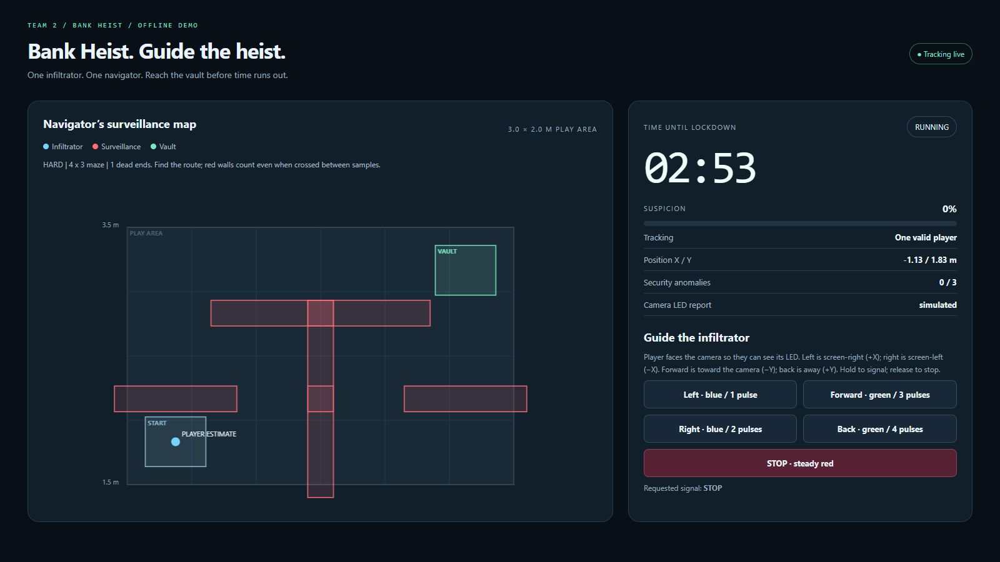
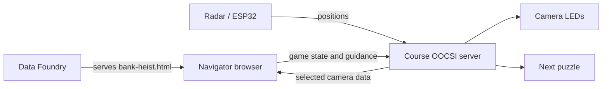

# Bank Heist

**[Play Bank Heist](https://data.id.tue.nl/web/djI6N01hckdUYks4bUZJeXE1RlhPY1hUQWxfRFl4bWd4NXpSRklGbmVvVUZ5U3dYTGxwbmVwWUdYQURTTG5iRGl3/)** - hosted on Data Foundry.

**A radar-guided escape-room maze, packaged as one OOCSI Thing.** One player crosses the room while a navigator uses the map and LED cues to guide them to the vault. Red maze walls cause penalties; reaching the vault before lockdown wins.

**[Get the module](bank-heist.html) · [Upload to Data Foundry](docs/DATA_FOUNDRY.md) · [DIY setup](docs/DIY.md) · [Hardware](https://github.com/beraltan/team-2-hardware-module)**

## Start here

For USB-controlled simulated radar positions, see the [camera simulator controls](docs/CAMERA_SIMULATOR.md). ESP source and [Mac flashing instructions](https://github.com/beraltan/team-2-hardware-module/tree/main/firmware/Concept1_Camera#flash-from-a-mac) are in the hardware repo.

You only need **bank-heist.html** to copy and run the software. It contains the application, styles and course libraries. Players do not need Python, Node or the rest of this repository.

1. Download [bank-heist.html](bank-heist.html). On GitHub, open it and choose **Download raw file**.
2. Upload it into an **Existing Dataset** in [TU/e Data Foundry](https://data.id.tue.nl/). Activate **Web Access** and select **bank-heist.html** as the **Web Access Entry Point**. [Detailed instructions](docs/DATA_FOUNDRY.md).
3. Open the generated web link. Choose **Try offline demo** to explore without hardware, or select your team for live play.
4. Configure the camera for the same team channel, select its sender, check the room and start. Follow the [DIY recipe](docs/DIY.md).

Live play needs internet, the compatible radar/ESP32/LED hardware and one visible controller page. First-time USB camera setup needs desktop Chrome/Edge. Afterwards, use the hosted page for play.

## Interface

Compact 16:9 presentation view of the working offline demo: maze, timer, status and directional guidance controls. Setup forms and long instructions are hidden for this capture; player and LED data are simulated.

## Documentation

| I want to… | Read |
| --- | --- |
| Upload and share the module | [Data Foundry hosting](docs/DATA_FOUNDRY.md) |
| Recreate the experience with another group | [DIY recipe](docs/DIY.md) |
| Understand the rules and run a round | [Playing and operating](docs/PLAYING.md) |
| Understand maze generation and difficulty | [Maze design](docs/MAZE.md) |
| Connect hardware or another puzzle | [Messages and integration examples](docs/INTERFACE.md) |
| Fix setup, connectivity or gameplay | [Troubleshooting](docs/TROUBLESHOOTING.md) |
| Use the earlier Python/USB tools | [USB diagnostics](docs/USB.md) |
| See what has actually been tested | [Validation and remaining checks](docs/VALIDATION.md) |
| Check credits and reuse terms | [Attribution and licence status](THIRD_PARTY.md) |

## How it connects

Data Foundry hosts the page. The browser runs the game and exchanges live messages directly through **wss://oocsi.id.tue.nl/ws**. This module does not record gameplay to a Data Foundry dataset.

The course selector maps **Team 2 → OOCSI-things/team-2**. All participating modules must use the exact same channel. Another group chooses its own team; no source edit is needed. The earlier prototype's `OOCSI-things/team-2-bank-heist` channel is different.

The module uses the course's `thing()`, `oocsiThings.register()`, `data()` and `link()` APIs. Outputs include `state`, `time_s`, `penalties`, `guide`, `round_id`, `tick` and `toggle`. See the [message contract](docs/INTERFACE.md) for next-puzzle triggers.

## The experience

| Setting | Default |
| --- | --- |
| Round time | 180 seconds |
| Wall penalty | 5 seconds per anomaly |
| Lockdown | 3 anomalies |
| Field | 3 m wide × 2 m deep, 1.5–3.5 m from the radar |
| Difficulty | Hard: 4 × 3 maze |

Normal, Hard and Expert offer winding passages and dead ends. Field dimensions limit grid size. Layouts stay fixed during a round. Walls are virtual penalty zones; radar estimates body position rather than footsteps. Walk-test the room before using narrower passages.

Keep **one controller per team**, visible with the screen awake. A hidden/suspended page, lost tracking or lost connection faults a running attempt. Reconnection never resumes that round automatically. Inspect and reset before trying again. Disconnecting the browser does not stop camera publishing.

## Source code

- [Complete standalone game](bank-heist.html) — HTML, CSS and JavaScript in one file.
- [Source files](app/) — game logic, interface and hardware connections.

## Status and credits

Local checks cover rules, generated mazes, controller behaviour and bundled course integration. The hosted offline demo has been checked. Physical hardware and live OOCSI still need end-to-end checks; see [validation](docs/VALIDATION.md).

Adapted from Toktik by Mathias Funk / TU/e for Designing Connected Experiences. Team 2: Anouk Kramer, Alp Altaner, Berk Eraltan Sönmezgil and Sebastiaan Schenk.

Team-owned code is released under the [MIT licence](LICENSE). Upstream Toktik/OOCSI material retains its existing attribution and terms; see [THIRD_PARTY.md](THIRD_PARTY.md).
